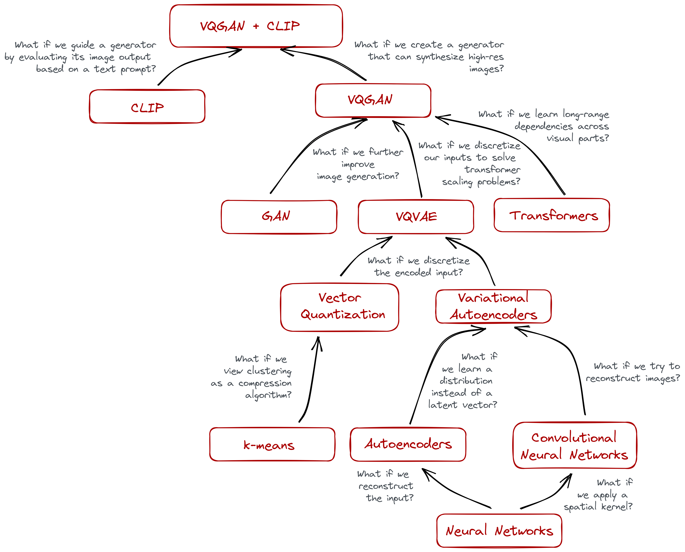

# Infusing the Diffusion Models

This repo is created to capture fundamental concepts and algorithms responsible towards popular generative and difussion models like Stable Diffusion, ChatGPT, etc.

The following figure represents a rough roadmap for getting there.

Starting from basic Neural Network, we would eventually want to reach to VQGAN + CLIP which can be considered as the basic Diffusion model. As depicted in the figure, in order to understand diffusion model, we want to start from basic Neural Network. For understanding diffusion models, one requires the prior knowledge on three sub fields of Deep Learning: Convolutional Neural Networks (CNNs), Natural Language Processing (NLP) and Generative Adversarial Networks (GAN). 

I have created separate repositories for basic Neural Network, CNN and NLP if you want to give a look. This repo contains implementation and descriptions of generative models.

[1] [Neural Network from Scratch](https://github.com/bkhanal-11/neural-network-from-scratch)

[2] [Natural Language Processing](https://github.com/bkhanal-11/natural-language-processing)

[3] [Convolutional Neural Networks](https://github.com/bkhanal-11/deep-learning)

[4] [Transformers](https://github.com/bkhanal-11/transformers)

[5] [Machine Learning Algorithms](https://github.com/bkhanal-11/machine-learning)

