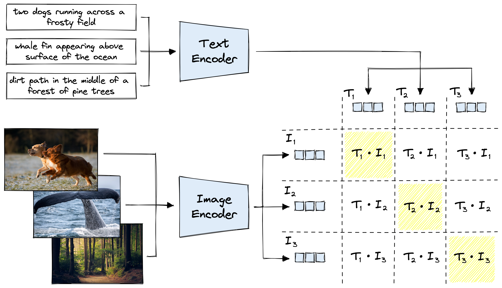

# CLIP

CLIP, [Contrastive Language-Image Pretraining](https://openai.com/research/clip/), is a neural network model developed by OpenAI that learns to understand images and text jointly. It consists of two main components:

**Image Encoder:** This component processes images by using a convolutional neural network (CNN) or vision-based transformers (ViT). It encodes the visual information into a high-dimensional feature space. Some popular vision encoder (backbone) are ResNet-50, VGG-16, ViT. For this project, pretrained [vit_base_patch16_224.augreg2_in21k_ft_in1k](https://huggingface.co/timm/vit_base_patch16_224.augreg2_in21k_ft_in1k) from Huggin Face was used.

**Text Encoder:** Responsible for processing text descriptions, captions, or prompts. It encodes the text into a compatible high-dimensional space generally 768. There are a lot of text encoders like BERT, RoBERTa, and BART. However for this project, [all-mpnet-base-v2](https://huggingface.co/sentence-transformers/all-mpnet-base-v2) was used for its high accuracy.

**Loss Function:**
The loss function in CLIP is formed by maximizing the similarity of correct image-text pairs while minimizing the similarity of incorrect pairs. This is achieved through a contrastive loss, encouraging the vision and text encoders to bring similar image-text pairs closer together in the shared embedding space while pushing dissimilar pairs apart. The loss is formed by computing similarities between the encoded representations of images and text using measures like cosine similarity.

## Strengths:

1. Data: CLIP was trained on 400 million text-image pairs obtained through web-scraping in contrast to 1.2 million images for ImageNet.

2. Contrastive pretraining: While training, the diagonal elements of the matrix shown in image above is maximized by CLIP while, in a contrastive fashion, the off-diagonal elements are minimized. This is obtained through cosine similarity in loss function.

3. Computational Efficieny: Due to use of transformers, it is more computationally efficient than LSTM counterparts.

4. V&L representation: CLIP excels in understanding relationships between images and text by gaining rich image-text representation, allowing it to perform tasks like zero-shot classification and multimodal retrieval.

## Limitations:

1. Computational Demands: While CLIP is computationally efficient, training and using CLIP can be computationally intensive due to its large-scale architecture, potentially requiring significant computational resources.

2. Specificity in Representations: While CLIP offers broad understanding, it might struggle with fine-grained tasks requiring highly specific or nuanced knowledge.

## Applications:

1. Zero-shot Learning: CLIP can classify images based on text descriptions, even for classes it hasn’t been explicitly trained on.

2. Image and Text Retrieval: It’s capable of retrieving relevant images based on textual prompts and vice versa.

3. Transfer Learning: CLIP’s pre-trained representations can be fine-tuned for downstream tasks like image classification or object detection.

### Resources:

[1] [Simple Implementation of OpenAI CLIP model: A Tutorial](https://towardsdatascience.com/simple-implementation-of-openai-clip-model-a-tutorial-ace6ff01d9f2)

[2] [OpenAI’s CLIP explained! | Examples, links to code and pretrained model](https://www.youtube.com/watch?v=dh8Rxhf7cLU)

[3] [OpenAI CLIP (Contrastive Language-Image Pretraining](https://github.com/R4j4n/OpenAI-CLIP-in-PyTorch)

[4] [Model $\cdot$ CLIP](https://vinija.ai/models/CLIP/)