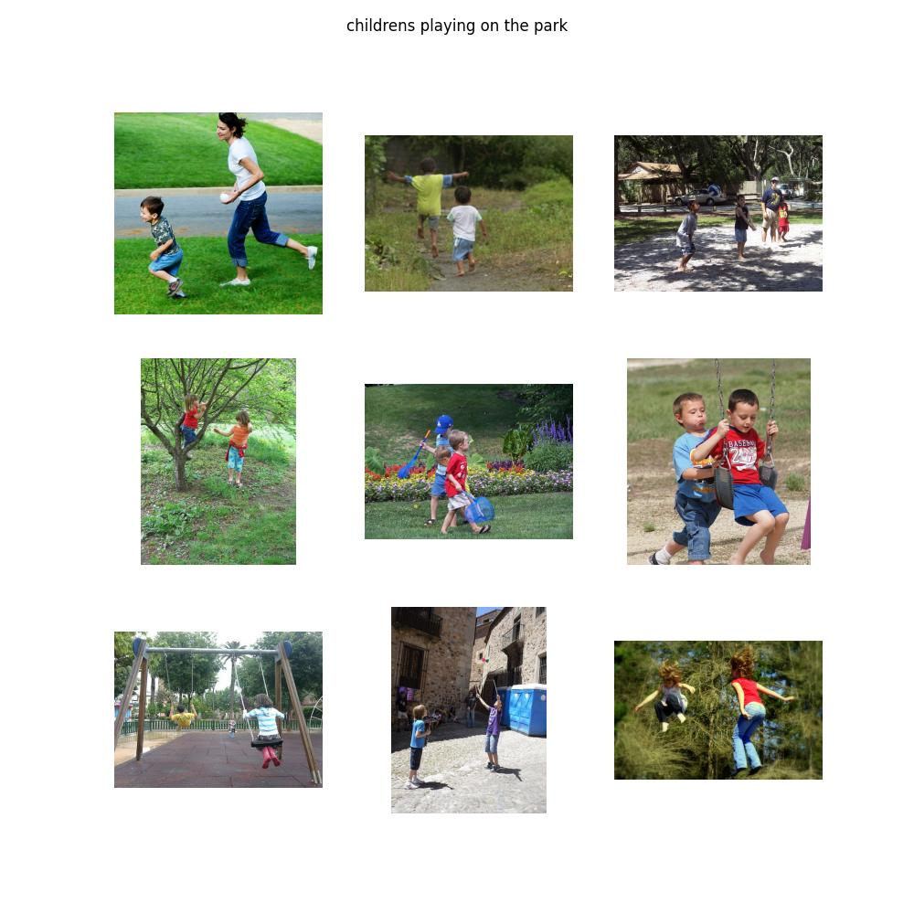
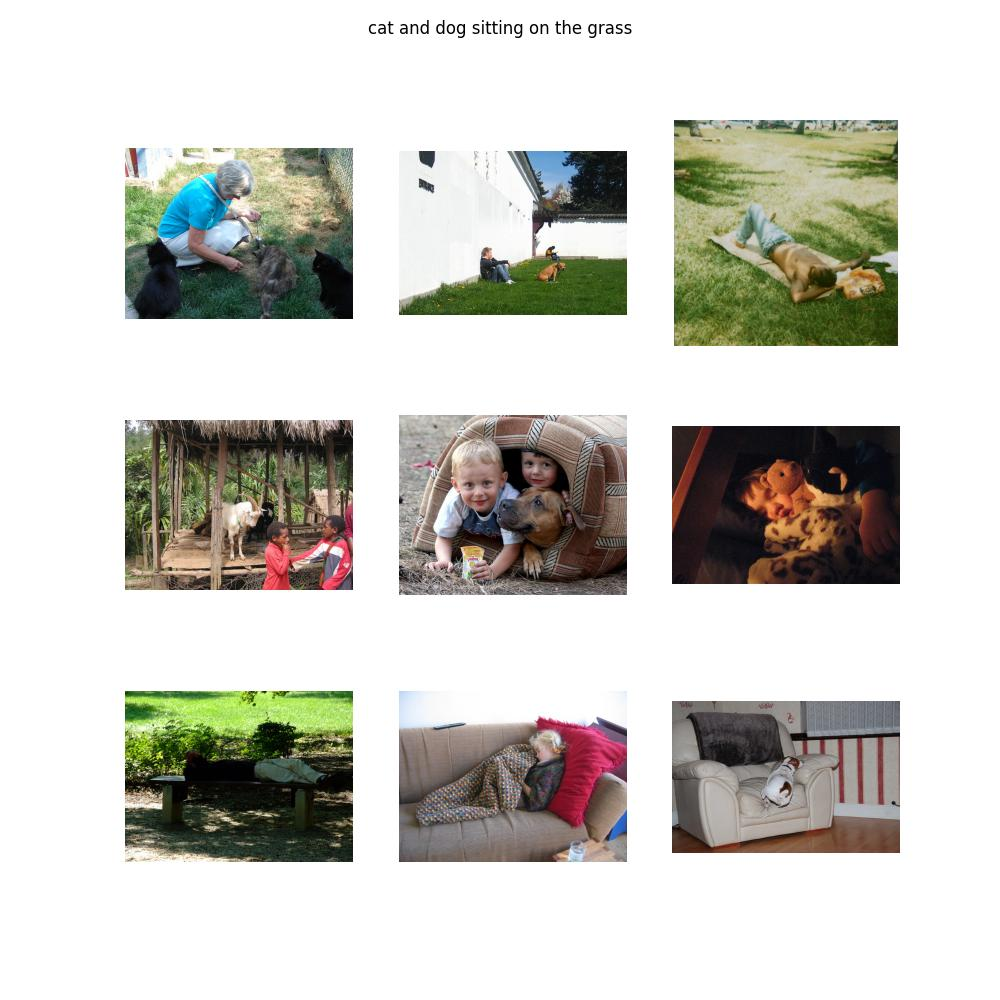
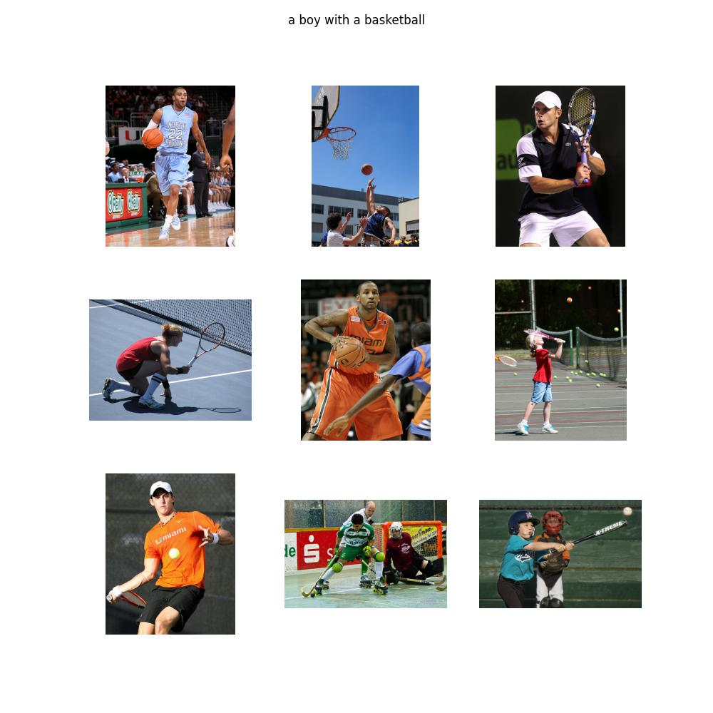
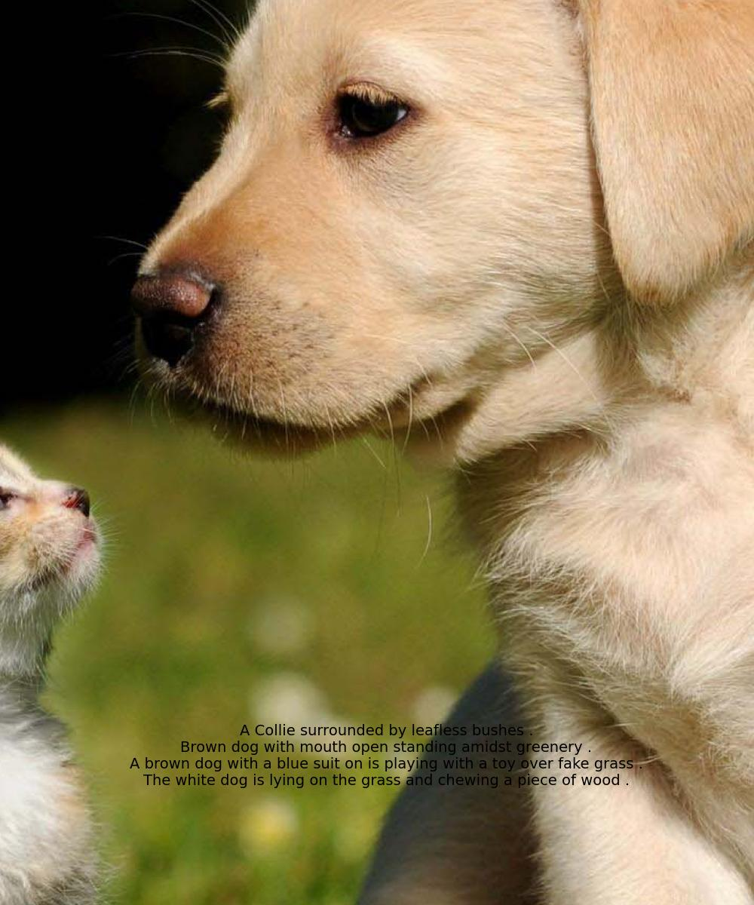
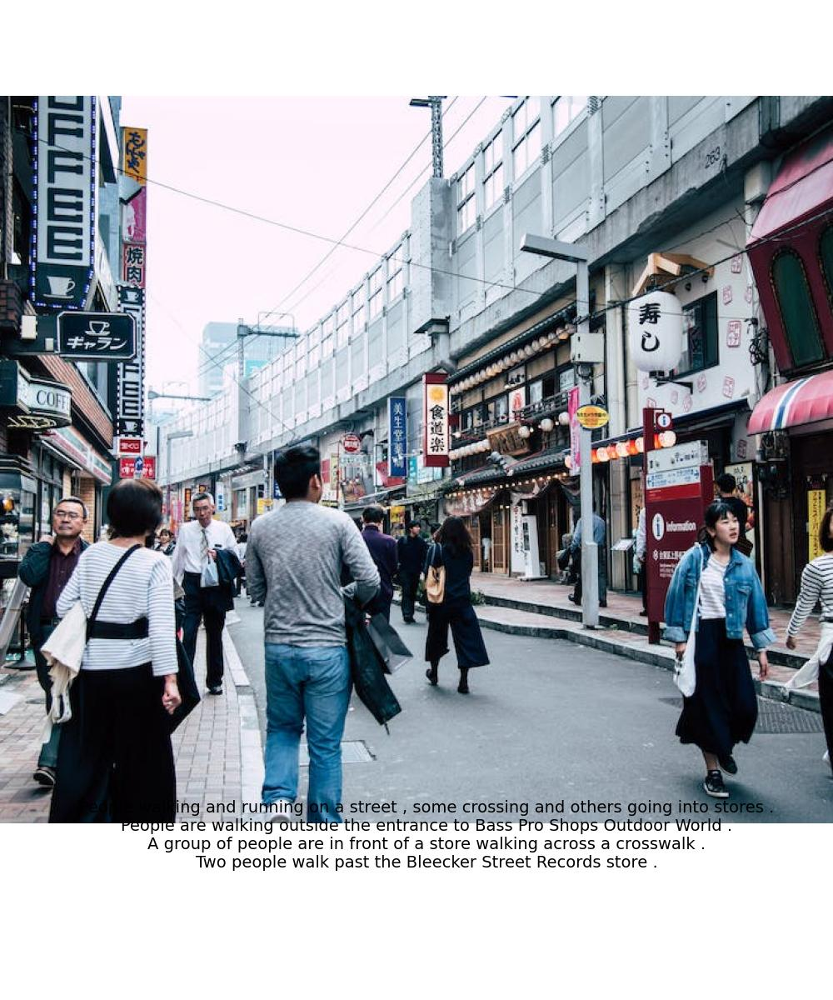
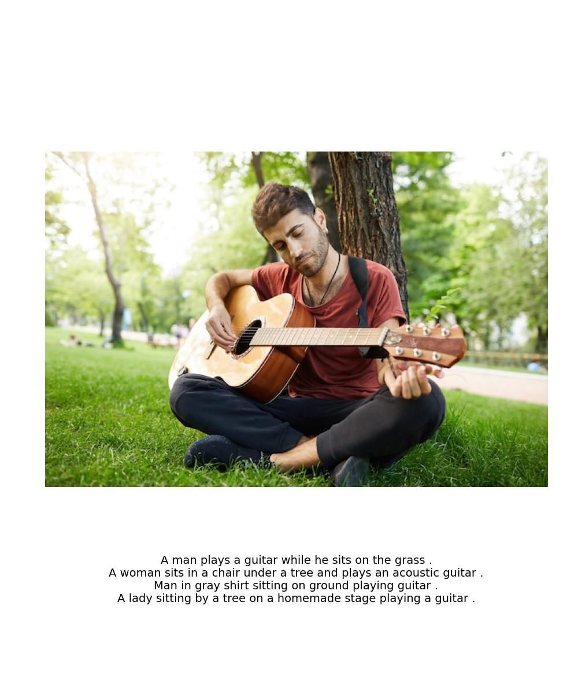

# CLIP (Contrastive Language-Image Pretraining)

### Installation

```bash
sudo apt-get install python3-venv
python3 -m venv clip-env
source clip-env/bin/activate
pip3 install -U pip
pip3 install -r requirements.txt
```

### Dataset

This project uses the [Flickr30k dataset](https://www.kaggle.com/datasets/hsankesara/flickr-image-dataset) from Kaggle which has become a standard benchmark for sentence-based image description. You can download the dataset as follow:

```bash
python3 download.py
```

Make sure you have `kaggle.json` file with your credentials in the given folder or you can manually provide them after running the script.

### Training

After downloading the dataset, run the following script to train the CLIP model. Tweak the hyperparameters for the model in `config.py`. You can also change the Image and Text encoder as required.

```bash
python3 train.py
```

Inference pipeline is given in `demo.ipynb`. After training the model, feel free to test the model with your own images and texts.

### How the training works?

Assume we have a batch of N images paired with their respective descriptions e.g. `<image1, text1>`, `<image2, text2>`, `<imageN, textN>`.

Contrastive Pre-training aims to jointly train an Image and a Text Encoder that produce image embeddings [`I1`, `I2`,...,`IN`] and text embeddings [`T1`, `T2`,..., `TN`], in a way that:

- The cosine similarities of the correct `<image-text>` embedding pairs `<I1,T1>`, `<I2,T2>` (where `i=j`) are maximized.

- In a contrastive fashion, the cosine similarities of dissimilar pairs `<I1,T2>`, `<I1,T3>`… `<Ii,Tj>` (where `i≠j`) are minimized.

Here’s a step-by-step breakdown of how CLIP works:

1. The model receives a batch of *(image,text)* pairs.

2. The text encoder is a standard Transformer model, say BERT. The image encoder can be either a ResNet or a Vision Transformer.

3. For every image in the batch, the Image Encoder computes an image vector. The first image corresponds to the `I1` vector, the second to `I2`, and so on. Each vector is of size `de`, where de is the size of the latent dimension. Hence, the output of this step is $N \times$ `de` matrix.

4. Similarly, the textual descriptions are squashed into text embeddings [`T1`, `T2`,...,`TN`], producing a $N \times$ `de` matrix.

5. Finally, we multiply those matrices and calculate the pairwise cosine similarities between every image and text description. This produces an $N \times N$  matrix.

6. The goal is to maximize the cosine similarity along the diagonal - these are the correct (image, text) pairs. In a contrastive fashion, off-diagonal elements should have their similarities minimized (e.g., `I1` image is described by `T1` and not by `T2`, `T3`, `T4`, etc). 

A few extra remarks:

- The model uses the symmetric cross-entropy loss as its optimization objective. This type of loss minimizes both the image-to-text direction as well as the text-to-image direction (remember, our contrastive loss matrix keeps both the (`I1`, `T2`) and (`I2`, `T1`) cosine similarities).

- Contrastive pre-training is not entirely new. It was introduced in previous models and was simply adapted by CLIP.

### Results

**Text to Image:**

The following results are the most relevant images a from the validation set related to the text query.







**Image to Text:**

The following results are the most relevant texts a from the validation set related to the image query.






