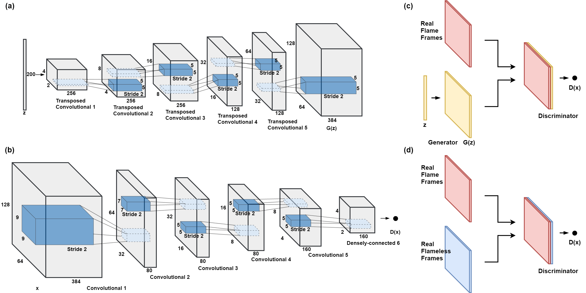

# Deep Convolutional GAN (DC-GAN)

It is a type of generative model that uses deep convolutional neural networks to generate images.

DCGAN was introduced in 2015 by [Radford et al.](https://arxiv.org/abs/1511.06434) and it extends the traditional GAN architecture by using convolutional neural networks instead of fully connected networks to generate images. This allows the model to learn features in a hierarchical way, which is important for generating realistic images.

In DCGAN, the generator network takes random noise as input and generates an image, while the discriminator network tries to distinguish between real and fake images. The generator and discriminator are trained together in an adversarial way, where the generator tries to fool the discriminator and the discriminator tries to correctly identify fake images.

DCGAN has been used to generate a wide range of images, including faces, landscapes, and objects, and has shown impressive results in terms of image quality and diversity. It has also been used in various applications, such as image editing and style transfer.
